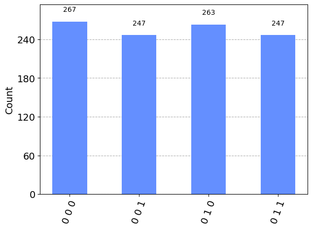

```python
from qiskit import QuantumCircuit, QuantumRegister, ClassicalRegister
from qiskit_aer import AerSimulator
from qiskit.visualization import plot_histogram
from qiskit.result import marginal_distribution
from qiskit.circuit.library import UGate
from numpy import pi, random
```

## Defining Alice and Bob Requirements

Alice has to communicate a qubit Q and has an e-bit shared with Bob. It is assumed that Alice and Bob can only send classical information. Alice and Bob share an e-bit.

### Assumptions :
1. State of Q is NOT known to Alice and Bob
2. Correlation between Q and other systems must be preserved by transmission
3. According to the "No cloning theorem", if Bob receives the transmission then Alice must no longer have the qubit Q in its original state.


```python
qubit = QuantumRegister(1, "Q")         # Q
ebit0 = QuantumRegister(1, "A")         # A
ebit1 = QuantumRegister(1, "B")         # B
a = ClassicalRegister(1, "a")           # a
b = ClassicalRegister(1, "b")           # b
```

## Defining the Protocol

1. Alice performs controlled-NOT operation where Q is the control and A is the target.
2. Alice performs a Hadamard operation on Q.
3. Alice measures A and Q, gets classical bits a and b respectively then sends a and b to Bob.
4. Bob performs X operation (NOT gate) if a = 1, and if b = 1 then Bob performs operation Z (phase flip operation) on B.

Therefore, 
    if ab = 00 then `1`
    if ab = 01 then operation Z
    if ab = 10 then operation X
    if ab = 11 then operation ZX


```python
protocol = QuantumCircuit(qubit, ebit0, ebit1, a, b)

protocol.h(ebit0)
protocol.cx(ebit0, ebit1)
protocol.barrier()

# Alice's operations
protocol.cx(qubit, ebit0)       # Controlled NOT where control is Q (qubit) and target is A (ebit0)
protocol.h(qubit)               # Hadamard gate on Q
protocol.barrier()

# Now measure ebit0, store in a and measure qubit, store in b and send to B
protocol.measure(qubit, b)
protocol.measure(ebit0, a)
protocol.barrier()

# Bob's actions based on classical bits
with protocol.if_test((a, 1)):
    protocol.x(ebit1)           # if a is 1 then operation X on ebit1
with protocol.if_test((b, 1)):
    protocol.z(ebit1)           # if b is 1 then operation Z on ebit1
    
print(protocol.draw())
```

                    ░      ┌───┐ ░ ┌─┐    ░                                     »
      Q: ───────────░───■──┤ H ├─░─┤M├────░─────────────────────────────────────»
         ┌───┐      ░ ┌─┴─┐└───┘ ░ └╥┘┌─┐ ░                                     »
      A: ┤ H ├──■───░─┤ X ├──────░──╫─┤M├─░─────────────────────────────────────»
         └───┘┌─┴─┐ ░ └───┘      ░  ║ └╥┘ ░ ┌────── ┌───┐ ───────┐ ┌────── ┌───┐»
      B: ─────┤ X ├─░────────────░──╫──╫──░─┤ If-0  ┤ X ├  End-0 ├─┤ If-0  ┤ Z ├»
              └───┘ ░            ░  ║  ║  ░ └──╥─── └───┘ ───────┘ └──╥─── └───┘»
                                    ║  ║    ┌──╨──┐                   ║         »
    a: 1/═══════════════════════════╬══╩════╡ 0x1 ╞═══════════════════╬═════════»
                                    ║  0    └─────┘                ┌──╨──┐      »
    b: 1/═══════════════════════════╩══════════════════════════════╡ 0x1 ╞══════»
                                    0                              └─────┘      »
    «               
    «  Q: ──────────
    «               
    «  A: ──────────
    «      ───────┐ 
    «  B:   End-0 ├─
    «      ───────┘ 
    «a: 1/══════════
    «               
    «b: 1/══════════
    «               


```python
# Randomly generated single qubit to check if protocol is successful
random_gate = UGate(
    theta=random.random() * 2 * pi,
    phi=random.random() * 2 * pi,
    lam=random.random() * 2 * pi,
)
print(random_gate.to_matrix())
```

    [[ 0.40990517+0.j         -0.64976358-0.64014454j]
     [ 0.13452095-0.90215401j  0.3275958 -0.24638028j]]


```python
test = QuantumCircuit(qubit, ebit0, ebit1, a, b)

test.append(random_gate, qubit)
test.barrier()

test = test.compose(protocol)       # Including the protocol as defined before
test.barrier()

# Apply random unitary to B and measure
test.append(random_gate.inverse(), ebit1)

result = ClassicalRegister(1, "Result")
test.add_register(result)
test.measure(ebit1, result)

print(test.draw())
```

              ┌──────────────────────────┐ ░            ░      ┌───┐ ░ ┌─┐    ░ »
           Q: ┤ U(2.2969,4.8604,0.77794) ├─░────────────░───■──┤ H ├─░─┤M├────░─»
              └──────────────────────────┘ ░ ┌───┐      ░ ┌─┴─┐└───┘ ░ └╥┘┌─┐ ░ »
           A: ─────────────────────────────░─┤ H ├──■───░─┤ X ├──────░──╫─┤M├─░─»
                                           ░ └───┘┌─┴─┐ ░ └───┘      ░  ║ └╥┘ ░ »
           B: ─────────────────────────────░──────┤ X ├─░────────────░──╫──╫──░─»
                                           ░      └───┘ ░            ░  ║  ║  ░ »
         a: 1/══════════════════════════════════════════════════════════╬══╩════»
                                                                        ║  0    »
         b: 1/══════════════════════════════════════════════════════════╩═══════»
                                                                        0       »
    Result: 1/══════════════════════════════════════════════════════════════════»
                                                                                »
    «                                                         ░ »
    «       Q: ───────────────────────────────────────────────░─»
    «                                                         ░ »
    «       A: ───────────────────────────────────────────────░─»
    «          ┌────── ┌───┐ ───────┐ ┌────── ┌───┐ ───────┐  ░ »
    «       B: ┤ If-0  ┤ X ├  End-0 ├─┤ If-0  ┤ Z ├  End-0 ├──░─»
    «          └──╥─── └───┘ ───────┘ └──╥─── └───┘ ───────┘  ░ »
    «          ┌──╨──┐                   ║                      »
    «     a: 1/╡ 0x1 ╞═══════════════════╬══════════════════════»
    «          └─────┘                ┌──╨──┐                   »
    «     b: 1/═══════════════════════╡ 0x1 ╞═══════════════════»
    «                                 └─────┘                   »
    «Result: 1/═════════════════════════════════════════════════»
    «                                                           »
    «                                            
    «       Q: ──────────────────────────────────
    «                                            
    «       A: ──────────────────────────────────
    «          ┌─────────────────────────────┐┌─┐
    «       B: ┤ U(-2.2969,-0.77794,-4.8604) ├┤M├
    «          └─────────────────────────────┘└╥┘
    «     a: 1/════════════════════════════════╬═
    «                                          ║ 
    «     b: 1/════════════════════════════════╬═
    «                                          ║ 
    «Result: 1/════════════════════════════════╩═
    «                                          0 


```python
# AER simulation
result = AerSimulator().run(test).result()
statistics = result.get_counts()
plot_histogram(statistics)
```


    

    


```python
filtered_statistics = marginal_distribution(statistics, [2])
plot_histogram(filtered_statistics)
```


    

    


```python

```
